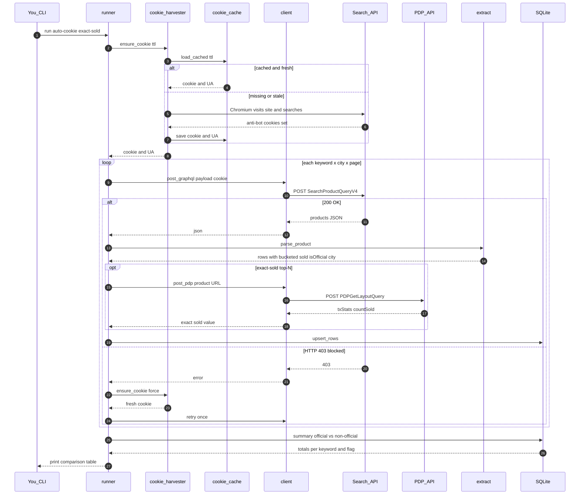

# Tokopedia IQOS Sold-Count PoC

Self-hosted scraper (no paid API) that queries Tokopedia's **own** internal GraphQL
search endpoint, normalizes each product, and stores observations in **SQLite** so
official-store vs non-official-seller sold counts can be compared per keyword/city.

- **Keywords:** `iqos`, `iluma`, `terea`
- **Cities:** `jabodetabek`, `bandung`, `medan`, `surabaya`
- **Metric:** sold count per product/seller + official-vs-non-official rollup
- **Stack:** Python + `curl_cffi` (browser-TLS impersonation) + SQLite. Fully local.

See [`../RESEARCH_PLAN.md`](../RESEARCH_PLAN.md) for the full research write-up.

## Layout

```
POC/
├── config/city_ids.json      # location filter (fcity IDs) — VERIFY in Phase 0
├── src/
│   ├── settings.py           # paths, cookie/UA, city IDs, POC defaults
│   ├── query.py              # the GraphQL queries (search + product detail)
│   ├── client.py             # HTTP POST (curl_cffi -> requests fallback)
│   ├── search.py             # build search payload + extract product list
│   ├── extract.py            # raw product JSON -> flat row (sold-label parsing)
│   ├── product_detail.py     # EXACT sold count from PDP (recursive countSold)
│   ├── cookie_harvester.py   # Playwright anti-bot cookie harvest + cache
│   ├── storage.py            # SQLite schema + upsert + official/non-official summary
│   └── runner.py             # CLI entry point
├── tests/                    # offline fixtures (search + PDP responses)
├── .env                      # OPTIONAL — only for manual cookie / UA override
└── requirements.txt
```

## Flow (sequence)



## Quick start

### 0. Create & activate a venv (once)

**Windows (PowerShell):**
```powershell
python -m venv .venv
.\.venv\Scripts\Activate.ps1
# if activation is blocked by execution policy, run once:
#   Set-ExecutionPolicy -Scope CurrentUser -ExecutionPolicy RemoteSigned
python -m pip install --upgrade pip
```

**macOS / Linux (bash):**
```bash
python3 -m venv .venv
source .venv/bin/activate
python -m pip install --upgrade pip
```

You'll know it's active when your prompt shows `(.venv)`. Run all the commands below with
the venv active. (`.venv/` is already covered by common ignores — don't commit it.)

### 1. Offline demo (no install, no cookie, no network)
Proves the parse -> store -> summarize pipeline works — needs **no** dependencies:
```bash
python src/runner.py --sample
```
Expected: 4 sample products parsed, and an official-vs-non-official sold-count table.

### 2. Live run (automatic cookie — recommended)
```bash
pip install -r requirements.txt
python -m playwright install chromium     # one-time

# FIRST time: run headful so YOU pass Tokopedia's Cloudflare challenge once.
python src/cookie_harvester.py --headful  # solve any challenge in the window

# After that, normal runs reuse the solved profile (headless is fine):
python src/runner.py --auto-cookie
```
By default this scrapes **until no more pages** (safety cap 30/keyword/city) and applies the
**IQOS category filter** (`sc=578`). Add `--pages 2` to limit, or `--category none` to widen.
**Why headful first:** Cloudflare blocks headless Chromium, so a pure headless harvest
usually returns *"Harvest produced no cookie."* Running `--headful` once lets you clear the
challenge in a real window; the harvester saves a **persistent browser profile**
(`data/pw_profile`) so later **headless** runs reuse that clearance automatically.

`--auto-cookie` then grabs the cookie and caches it (`data/cookie_cache.json`, reused for
`--cookie-ttl` minutes). If a request gets blocked mid-run it re-harvests once and retries.
If headless starts failing again later, re-run the `--headful` line to refresh the profile.

### 2b. Live run (manual cookie — no Playwright)
```bash
pip install curl_cffi requests python-dotenv
cp .env.example .env      # then paste a fresh TOKPED_COOKIE (see below)
python src/runner.py --pages 2
```
Runs the default 3 keywords x 4 cities. Data lands in `data/tokped.db`.

Useful flags:
```
--keywords iqos iluma      # override keywords
--cities jabodetabek       # override cities
--pages 3                  # fixed page cap; OMIT to scrape until no more results
--max-pages 30             # safety cap when scraping until exhausted (default 30)
--category iqos            # category filter: name in category_ids.json / sc id / "none"
--delay 5                  # base seconds between requests (jitter added on top)
--official-only            # apply Tokopedia's official-store filter
--exclude-official         # keep only NON-official sellers (drop the IQOS official store)
--exact-sold               # also fetch precise sold count from product detail
--exact-top 10             # with --exact-sold: only top-N ranked per keyword/city
--auto-cookie              # harvest anti-bot cookie via Playwright (no manual paste)
--refresh-cookie           # force a fresh harvest even if a cookie is cached
--headful                  # show the browser during harvest (if headless is blocked)
--cookie-ttl 30            # minutes a harvested cookie is reused before re-harvesting
--reset-today              # delete today's rows first (clears stale/sample data)
--export out.csv           # CSV export path (default: data/export_<date>.csv)
--no-export                # skip the CSV export
--no-report                # skip the HTML report
--db path/to.db            # custom SQLite path
```

### Outputs (all under `data/`, gitignored)
| Path | What |
|---|---|
| `data/logs/run_<ts>.log` | full execution log (DEBUG); console shows INFO |
| `data/export_<date>.csv` | one row per product — incl. `shop_id`, `shop_name`, `product_id`, `name`, urls, sold counts, and **`is_relevant`** (1 = real IQOS product, 0 = accessory/noise) |
| `data/sellers_<date>.csv` | **one row per seller of REAL IQOS products** — sold total, #products (deduped), is_official, sample product names |
| `data/export_<date>.html` | **shareable single-file report** — summary + searchable/sortable product table |
| `data/raw/<kw>_<city>_pN.json` | raw API response, saved when a page returns **0 products** (for debugging) |
| `data/tokped.db` | SQLite history (idempotent per `scrape_date`) |

### Shareable HTML report
Auto-generated after each run (unless `--no-report`). It's a **single self-contained `.html`**
(no internet needed) — just double-click to open, or email it to a stakeholder. It shows
summary cards, an official-vs-non-official table, and a product table with search + filters +
click-to-sort. Regenerate from any CSV without re-scraping:
```bash
python src/report.py                       # newest data/export_*.csv
python src/report.py data/export_2026-07-01.csv --out report.html
```

### Exact vs bucketed sold count
Search results only give a **bucketed label** (`1rb+` -> stored as `sold_count` ~1000).
With `--exact-sold`, the runner opens each top-N product's detail page
(`PDPGetLayoutQuery -> txStats.countSold`) and stores the **precise** number in
`sold_count_exact`. The official-vs-non-official summary uses
`COALESCE(sold_count_exact, sold_count)`, so exact numbers win when present.
It costs one extra request per product — that's why it's capped by `--exact-top`.

By default we fetch **unfiltered** results and tag each row `is_official`, so the
official-vs-non-official comparison is done on the *same* search ranking (fairer, and
half the requests). Use `--official-only` if you specifically want the filtered view.

## The cookie: automatic vs manual

The cookie is **anti-bot, not login** — you do NOT log in. It just proves "a real browser
already passed the challenge." Two ways to get it:

- **Automatic (recommended):** `--auto-cookie` runs Playwright to harvest + cache it. If
  headless gets blocked, add `--headful` to solve the challenge in a visible window once.
  Test the harvester alone with: `python src/cookie_harvester.py --headful`
- **Manual:** DevTools (F12) -> Network -> filter `graphql` -> click a request -> copy the
  `cookie` **request header** (not `document.cookie`) into `.env` as `TOKPED_COOKIE=...`.

Either way the cookie expires in minutes–hours; auto mode re-harvests on block, manual mode
needs a re-paste.

## Phase 0 (still manual, one-time — verify these in DevTools)

`--auto-cookie` solves the cookie, but two things still need a human eyeball once:

1. **Operation/schema:** confirm the search op is still `SearchProductQueryV4` (vs V5) and the
   `params`/variables shape — update `src/query.py` / `src/search.py` if they differ. Same
   for the PDP op in `src/product_detail.py`.
2. **Location IDs:** tick each city in the site's location filter and copy the `fcity` values
   into `config/city_ids.json`, then set `"verified": true`.

## Reducing irrelevant products (noise)

Keywords like `iluma`/`terea` collide with other brands (sandals, t-shirts, homeware) and
`iqos` returns many accessories. Three levers, weakest→strongest:

1. **Tighter keywords** — default is now `iqos`, `iqos terea`, `iqos iluma` (edit in
   `src/settings.py` or pass `--keywords`).
2. **Term filter** (`config/filters.json`) — any product whose name contains an
   `exclude_term` (case-insensitive) is flagged **noise**. Optional `require_any` demands at
   least one listed token. The report keeps ALL rows but adds a **"Relevant only"** toggle
   (default on) + Relevant/Noise cards. **Tune the JSON and re-run `python src/report.py`
   instantly — no rescrape.** On the first real run this cut 421 → 49 relevant.
3. **Category filter** (implemented, strongest) — Tokopedia's `sc` param filters
   **server-side**. Default `--category iqos` = `sc=578` ("Audio, Kamera & Elektronik
   Lainnya"), where IQOS devices/TEREA/BONDS live; accessories and unrelated items are in
   other categories and never get scraped. Disable with `--category none`. IDs in
   `config/category_ids.json`.

## Notes & limits

- **Sold count is bucketed** in search results (`1rb+` = 1000, `Terjual 250` = exact-ish).
  For precise numbers use daily deltas (re-run daily; the schema is idempotent per day)
  or add a product-detail call (`PDPGetLayoutQuery -> txStats.countSold`) — see plan §6.
- **`terea`** (tobacco heat-sticks) may return few/accessory results due to Tokopedia
  listing restrictions — eyeball the raw output before trusting the totals.
- **Anti-bot:** keep `--delay` reasonable, use a real cookie, and prefer `curl_cffi`.
  If live runs get blocked, the plan's fallback is a headless-browser capture (Playwright),
  **not** a paid API.
- For legal/ToS considerations see plan §10 — intended for internal competitive analysis.
</content>
